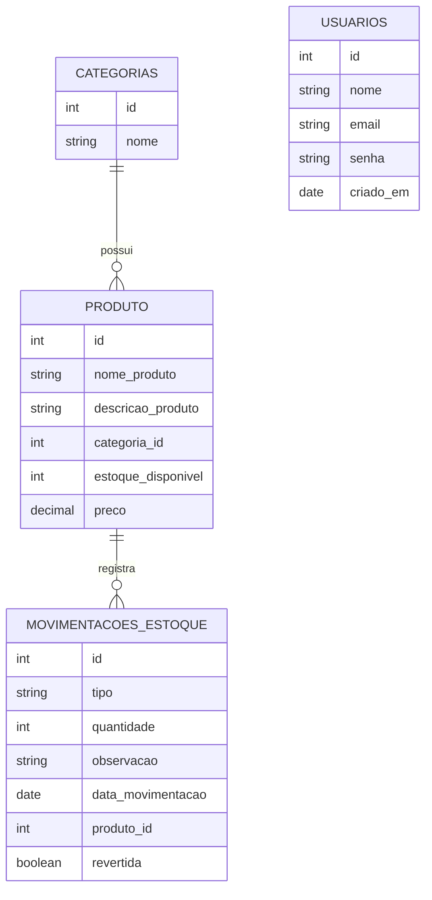

# Catálogo de Produtos Climba

Aplicação web desenvolvida como desafio técnico para gerenciamento de estoque. O projeto foi construído com backend em Node.js + TypeScript e frontend em HTML, CSS e JavaScript, permitindo cadastrar, consultar e gerenciar categorias, produtos e movimentações de estoque.

## Sobre o projeto

Este projeto foi desenvolvido com foco em organização, validação de dados e controle de estoque, utilizando uma arquitetura em camadas para separar responsabilidades.

O objetivo principal foi entregar uma aplicação funcional, com API estruturada, interface simples de uso, autenticação de usuário e regras de negócio aplicadas ao fluxo de estoque.

A base do projeto foi desenvolvida seguindo o modelo aplicado anteriormente no Desafio Técnico To-Do List, com adaptações para o contexto de gerenciamento de estoque.

## Funcionalidades

- Login de usuário com autenticação JWT
- Cadastro de categorias
- Listagem de categorias cadastradas
- Cadastro de produtos
- Listagem de produtos cadastrados
- Exclusão de categorias e produtos
- Registro de movimentações de estoque
- Reversão de movimentações
- Alerta visual para produtos com estoque baixo
- Dashboard com métricas do sistema
- Documentação da API com Swagger

## Funcionalidades adicionadas além do solicitado

- Sistema de login com autenticação JWT
- Reversão de movimentações de estoque
- Bloqueio de reversões inválidas
- Proteção de rotas no frontend e no backend
- Separação entre tela de login e tela principal da aplicação

## Regras do projeto

- O nome da categoria é obrigatório
- O nome do produto é obrigatório
- A descrição do produto é obrigatória
- O preço do produto deve ser maior que zero
- O estoque inicial do produto não pode ser negativo
- A movimentação pode ser do tipo:
  - `entrada`
  - `saida`
- A quantidade da movimentação deve ser maior que zero
- Uma saída não pode deixar o estoque negativo
- Uma movimentação revertida não pode ser revertida novamente
- Movimentações geradas por reversão não podem ser revertidas

## Tecnologias utilizadas

### Backend

- Node.js
- TypeScript
- Express
- TypeORM
- PostgreSQL
- Zod
- Swagger
- JWT
- bcryptjs

### Frontend

- HTML
- CSS
- JavaScript

## Arquitetura do projeto

- `backend`: responsável pela API, autenticação, validações, regras de negócio e persistência dos dados
- `frontend`: responsável pela interface e consumo dos endpoints da API

## Modelo relacional

## Documentação da API

A documentação da API está disponível via Swagger na rota:

- `/swagger`

Em ambiente local:

- `http://localhost:3000/swagger`

Em produção:

- `https://catalogo-produtos-climba.onrender.com/swagger`

## Publicação

- Aplicação publicada no `Render`

Sistema online:

- `https://catalogo-produtos-climba.onrender.com/`

## Decisões técnicas

- Utilização do TypeORM para organizar o acesso ao banco de dados
- Utilização do Zod para validação e tipagem dos dados de entrada
- Uso de JWT para autenticação das rotas privadas
- Uso de bcryptjs para armazenamento seguro de senhas
- Separação em camadas para melhorar manutenção e legibilidade
- Documentação integrada com Swagger para facilitar testes e entendimento da API
- Interface simples e funcional, com foco em cadastro e controle de estoque

## Apoio durante o desenvolvimento

Durante o desenvolvimento, utilizei o Codex como apoio em tarefas como:

- configuração do ambiente
- organização de importações
- criação e ajuste de arquivos
- apoio na estilização do frontend
- ajustes em JavaScript
- implementação da autenticação
- organização do Swagger
- correções de integração entre frontend e backend
- apoio no deploy

## Considerações finais

Este projeto foi construído com foco em entregar uma aplicação funcional, organizada e com regras de negócio consistentes para controle de estoque. Além disso, a solução foi disponibilizada em ambiente online para facilitar demonstração e avaliação.
